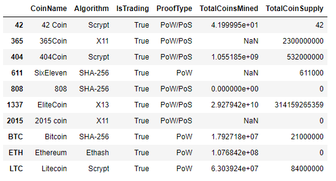
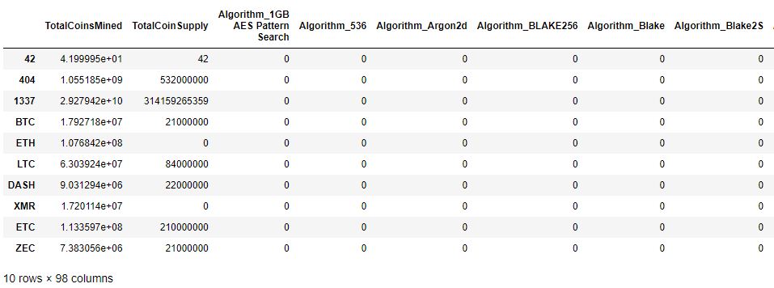
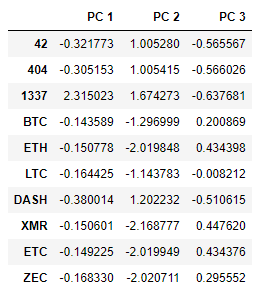
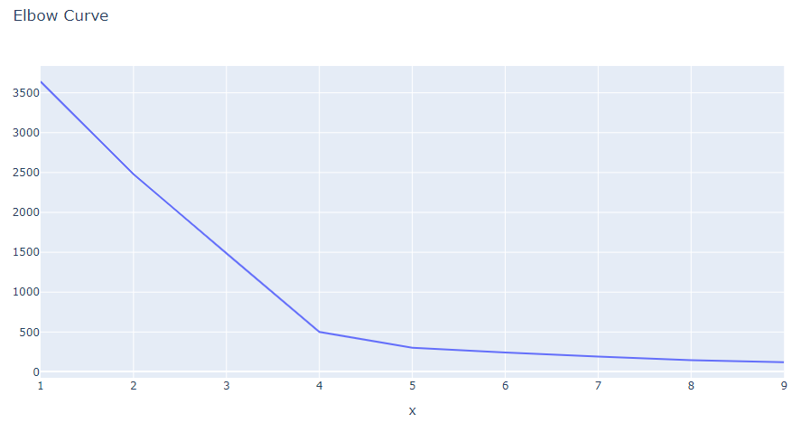
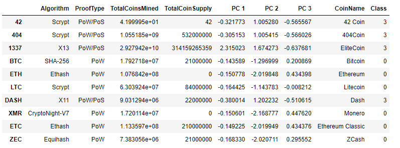
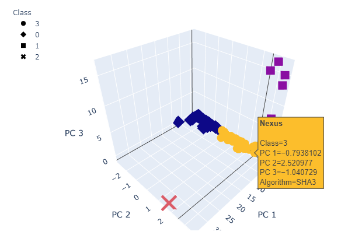
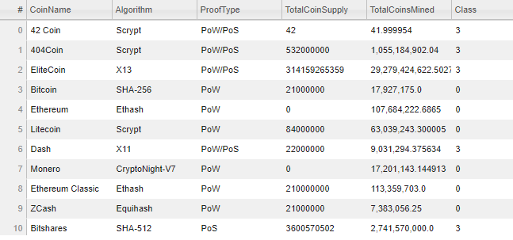
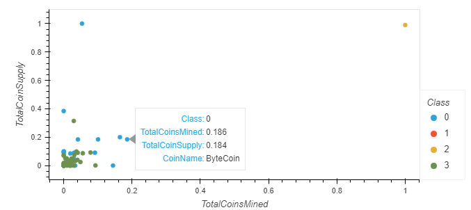

# Cryptocurrencies

## Overview

This project is the weekly challenge for week 18 of the Data Science Bootcamp. It allows us to put into practice and showcase the skills learned in Module 18 of the bootcamp: Unsupervised Machine Learning.

### Purpose

Create an analysis for clients who are preparing to get into the cryptocurrency market. The analysis includes cryptocurrencies on the trading market and how they could be grouped to create a classification system.

## Results

Files:

- [crypto_clustering.ipynb](crypto_clustering.ipynb) : Jupyter Notebook file with Python Analysis

- [crypto_data.csv](./Resources/crypto_data.csv) : data file retrieved from [CryptoCompare](https://min-api.cryptocompare.com/data/all/coinlist)

### Deliverable 1: Preprocessing the Data for PCA

The dataset was loaded from the source file and transformations were done to prepare the data for PCA.

The initial dataframe looked like this:



After cleaning operations, the dataframe had this look:



This final dataframe was the scaled using the code below to be ready for the next deliverable:

```python
# Standardize the data with StandardScaler().
scaler = StandardScaler()
crypto_scaled = scaler.fit_transform(crypto_encoded_df)
```

### Deliverable 2: Reducing Data Dimensions Using PCA

Reduced the dimesions of the `crypto_scaled` dataset to 3 principal components.

The `pcs_df` dataframe was created as required.

```python
pca = PCA(n_components=3)
crypto_pca = pca.fit_transform(crypto_scaled)
pcs_df = pd.DataFrame(data=crypto_pca, columns=['PC 1','PC 2', 'PC 3'], index=crypto_encoded_df.index)
```



### Deliverable 3: Clustering Cryptocurrencies Using K-means

Created an elbow chart to find the best value for K from the `pcs_df` dataframe from the previous deliverable.



Then I ran the K-means algorith with 4 clusters to predict the clusters for the data.

A dataframe with all the data `clustered_df` was created.

```python
clustered_df = pd.concat([crypto_df,pcs_df, cryptonames_df], axis=1)
clustered_df['Class']= predictions
```



### Deliverable 4: Visualizing Cryptocurrencies Results 

Visualized the clusters that correspond to the 3 principal components with a 3D scatter chart.



Also created a table using the `hvplot.table` functionality.



The looked at the relationship between Total Coin Supply and Total Coins Mined by scaling those variables and plotting them on a scatter chart.



## Summary

We provided the client with a list of cryptocurrencies being traded and classified them into 4 clusters.